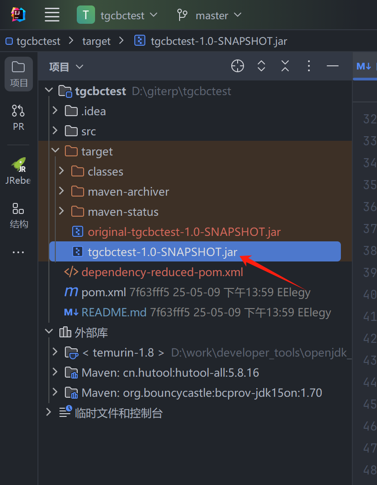

# BC包冲突处理工具

这个项目主要用于解决BouncyCastle (BC) 加密库的JAR包冲突问题。通过使用Maven Shade插件，我们可以重命名BC包的包名，从而避免与其他依赖中的BC包发生冲突。

## 项目背景

在实际开发中，经常会遇到多个依赖同时引入不同版本的BouncyCastle库的情况，这会导致类加载冲突。本项目通过重命名BC包的包名（示例从`org.bouncycastle`重命名为`testznsb.org.bouncycastle`）来解决这个问题。

## 技术栈

- Java 8
- Maven
- BouncyCastle 1.70
- Hutool 5.8.16

## 使用方法

1. 克隆项目到本地
2. 在项目根目录执行Maven打包命令：
   ```bash
   mvn clean package
   ```
3. 打包完成后，会在`target`目录下生成一个包含重命名后BC包的JAR文件

## 配置说明

项目使用Maven Shade插件进行包重命名，主要配置如下：

```xml
<relocations>
    <relocation>
        <pattern>org.bouncycastle</pattern>
        <shadedPattern>testznsb.org.bouncycastle</shadedPattern>
    </relocation>
</relocations>
```

## 注意事项

1. 使用重命名后的BC包时，需要将代码中的`org.bouncycastle`包引用改为`testznsb.org.bouncycastle`，也支持将.class文件放入工程中，在install时会自动修改依赖路径
2. 确保项目中其他依赖不会与重命名后的包发生冲突
3. 建议在项目启动时添加以下JVM参数来禁用BC的安全检查：
   ```
   -Dorg.bouncycastle.jce.provider.BouncyCastleProvider.PKCS12.legacy=true
   ```
4. 更新到容器后可能会发生如下情况，请参数知识库处理：修改容器的jdk环境

## 依赖说明

- bcprov-jdk15on: 1.70 - BouncyCastle加密库
- hutool-all: 5.8.16 - 工具类库

## 打包完成的示例图片
